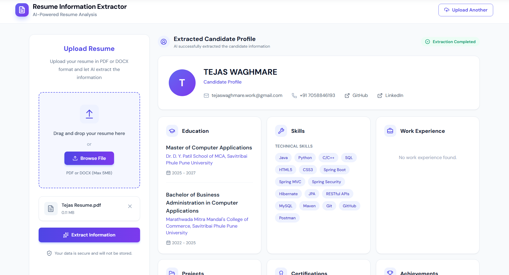

# Resume Information Extractor


An AI-powered web application that extracts structured information from resumes and presents it in a clean, user-friendly dashboard.

The application accepts resume files, extracts their text, and uses AI to identify and organize important candidate information such as personal details, education, skills, work experience, projects, and certifications.

## Features

* Upload resume files
* Support for PDF and DOCX resumes
* Resume file validation
* Extract text from uploaded documents
* AI-powered information extraction using Gemini
* Structured candidate profile generation
* Extract:

  * Personal information
  * Education
  * Technical and soft skills
  * Work experience
  * Projects
  * Certifications and achievements
* User-friendly frontend dashboard
* Global exception handling with structured error responses

## Tech Stack

### Backend

* Java 21
* Spring Boot
* Spring AI
* Google Gemini
* Apache PDFBox
* Apache POI
* Maven

### Frontend

* HTML
* CSS
* JavaScript

## How It Works

```text
Resume Upload
      ↓
File Validation
      ↓
Text Extraction
(PDF / DOCX)
      ↓
AI Processing
(Google Gemini)
      ↓
Structured Candidate Profile
      ↓
Frontend Dashboard
```

## Project Structure

```text
resume-information-extractor/
│
├── frontend/                # Frontend dashboard
│
├── src/
│   ├── main/
│   │   ├── java/            # Spring Boot application
│   │   │   └── com/nexoraa/resumeextractor/
│   │   │       ├── controller/
│   │   │       ├── service/
│   │   │       ├── model/
│   │   │       ├── exception/
│   │   │       └── config/
│   │   │
│   │   └── resources/
│   │       └── application.properties
│
├── pom.xml
└── README.md
```

## Prerequisites

Make sure you have the following installed:

* Java 21+
* Maven
* A Google Gemini API key

## Setup

### 1. Clone the repository

```bash
git clone https://github.com/waghmaretejas/resume-information-extractor.git
cd resume-information-extractor
```

### 2. Configure your Gemini API key

Add your Gemini API key to `application.properties` or configure it as an environment variable.

Example:

```properties
spring.ai.google.genai.api-key=YOUR_GEMINI_API_KEY
```

> Never commit your API key to GitHub.

### 3. Run the backend

On Windows:

```bash
./mvnw.cmd spring-boot:run
```

On macOS/Linux:

```bash
./mvnw spring-boot:run
```

The backend will start on:

```text
http://localhost:8080
```

## Usage

1. Open the application.
2. Upload a PDF or DOCX resume.
3. The application validates the uploaded file.
4. Resume text is extracted from the document.
5. Gemini AI analyzes the content.
6. The extracted information is returned as a structured candidate profile.
7. The frontend displays the extracted information in the dashboard.

## API

The application exposes REST APIs for resume processing and information extraction.

Example flow:

```text
POST Resume File
        ↓
Resume Validation
        ↓
Text Extraction
        ↓
AI Analysis
        ↓
Candidate Profile Response
```

## Error Handling

The application includes global exception handling to provide consistent error responses for cases such as:

* Invalid file type
* Empty files
* File size validation failures
* Resume processing errors
* AI processing errors

## Future Improvements

* Support for additional resume formats
* Multiple language support
* Candidate profile export
* Resume comparison
* Database persistence
* Authentication and user accounts
* Resume scoring and job matching

## Author

**Tejas Waghmare**

GitHub: [github.com/waghmaretejas](https://github.com/waghmaretejas?utm_source=chatgpt.com)

---

⭐ If you found this project useful, consider giving it a star!
